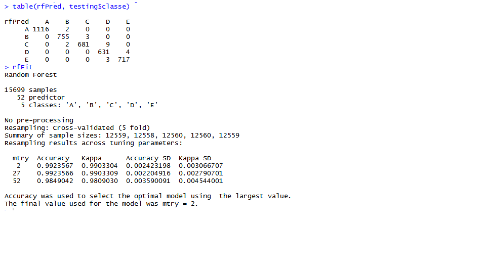

The Internet of Things (IoT) has exploded.  Every device now collects data.  From our phones noting our current location, our cars reporting operating conditions, to smart devices that control the temperature of our homes, this data is being recorded in large databases.  Nowhere is this trend quite as prevalent as in the area of wearable technology.  

Wearable technology, such as Fitbit and Jawbone, record such things as steps taken or repititions performed.  Accelerometers, blah blah.   Et al wanted to investigation whether this data could also be used to determine if a person was performing an exercise properly.  

## Analyzing and Cleaning the Data Set

After reviewing the contents of the first 7 columns, I removed them.  I also removed all columns that were sparsely populated or filled with NA's.  After these two reductions, I end up with a data set that has 52 predictors and a result.  These predictors represent the sensors used in determining the correctness of an exercise.  For training and testing, I used a 75/25 split.

```{r echo=FALSE, warning=FALSE}
library(lattice)
library(ggplot2)
library(caret)

# Read in the raw data (which I cleaned by removing the NA and sparse columns)
rawdata <- read.csv(file="C:/Development/R Projects/Practical Machine Learning/pml-trainingClean.csv"
                    , header=TRUE, sep = ",")
quizing <- read.csv(file="C:/Development/R Projects/Practical Machine Learning/pml-testingClean.csv"
                    , header=TRUE, sep = ",")

# Create a training set and a test set of data
inTrain <- createDataPartition(y=rawdata$classe, p=0.80, list=FALSE)
training <- rawdata[inTrain,]
testing <- rawdata[-inTrain,]
```

A complete description of dataset and the study can be found here: 
http://groupware.les.inf.puc-rio.br/public/papers/2013.Velloso.QAR-WLE.pdf

I chose to start by fitting a random forest with the thinking that with the large number of predictors, this would be the best model.  Running it with 5 fold cross validation, I received some surprisingly good results for an initial attempt.  In fact, it achieved 100% on the quiz data.  See the Confusion Matrix for this model below.



The difference in accuracy between the training and test sets could be explained by overfitting which is a common problem with the random forest model.  Another problem is that it took 45 minutes to generate the model.  By increasing the number of cross validation folds we could increase the accuracy, but we risk overfitting and also the time to generate the model can be time consuming.  In fact, I did run the same random forest model with 9 folds and saw increased accuracy in the out of sample results.  But it took 3 hours to run.

Here are the results for some other models that I fit against the training.

```{r, echo=FALSE}

Model <- c("Random Forest (5 fold cross validation)"
           ,"Random Forest (9 fold cross validation)"
           ,"Classification and Regression Trees"
           ,"Linear Discriminant Analysis")
inSample <- c(99.2,99.4,50.4,70.0)
outSample <- c(96.6,99.2,49.2,71.0)
model.data <- data.frame(Model, inSample, outSample, stringsAsFactors=FALSE)

g <- ggplot(model.data, aes(inSample, outSample, colour=Model)) + geom_point()
g <- g + ggtitle("Comparison of Model Accuracy") 
g <- g + ylab("Out of Sample Accuracy")  
g <- g + xlab("In Sample Accuracy")  
g
```

Not listed in the graph above are the models that I was not able fit on this data set.  For example, the Naive Bayes model would not run for me.  The warnings I received were vague, so it is still not clear to me whether the failure was due to incompatibility between the model and the data, or my laptop simply couldn't handle the calculations.

## Conclusions

As someone who is not very experienced with the various models, this assignment was a great one for taking a deeper dive into models using the Caret package.  

I focused on using the Random Forest model.  Because of the large number of predictors, it seemed a logical choice to start.  I was surprised that my initial model achieved an accuracy of 99.2 percent on the test model, although it only achieved 96.6 accuracy out of model.  This is likely explained by the tendency of random forest models to overfit the test data.

Changing the cross validation of the Random Forest model to 9 fold improved the out of sample accuracy to over 99% but at a great cost to performance.

One of the requirements of the assignment is to explain how I chose the final model for the fit.  To be honest, there was guesswork and luck involved.  I decided to only use Caret to fit the model.  I started with the Random Forest model, it seemed to make the most sense when 52 predictors were involved. I then chose some others that didn't work with the data (such as Naive Bayes).  I ran it with a couple of options that ran fast, but had awful results (Linear Discriminant Analysis and Classification and Regression Trees).

## Last Thoughts

If this assignment needed additional improvement, I would spend time tweaking the parameters of the various models.  I was surprised that the Classification and Regression Tree model had such poor results, but maybe I missed something.  I would spend more time learning of the various parameters available to each model.  Also, I would check out some of the more involved models that Caret provides. 

Additionally, while investigating how to use the "rf" model within Caret, I learned that there is another package that contains a randomForest function.  This function is purported to run much faster.

However, it is my conclusion that the random forest model with 5 fold cross validation is sufficient for this task.  The goal of this task was to determine if an individual is performing an exercise correctly while measured by wearable technology.  The downside of a a false positive is that someone would receive training on the correct way to perform the exercise.  This is unlike a prediction of medical conditions where false positive can be costly and stressful.